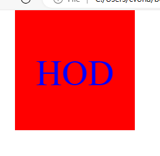
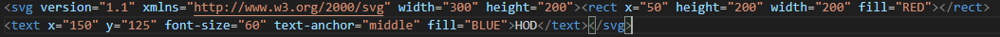
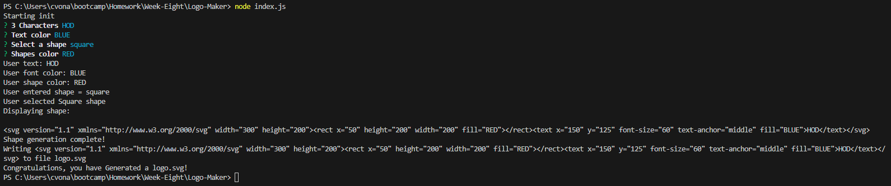

# Logo-Maker

## Description
  In this project I have made a svg generator that creates Logo's when the questions give have been filled out
  and they are used as the building blocks for the logo.svg

  ## Table of Contents
  * [Installation](#installation)

  * [Usage](#usage)

  * [Images](#images)

  * [Questions](#questions)

  ## Installation
  npm i jest
  npm i inquirer
  npm i node

  ## Usage
  By going to the Terminal and typing 'node index.js' then answering all the question shown

  ## Images
  
  
  

  ## Questions
  Here are ways to contact me if you have any questions
  Github: [Link text](https://github.com/Christopher-VA)
  Email: [link text](cvonaltenstadt@gmail.com)
